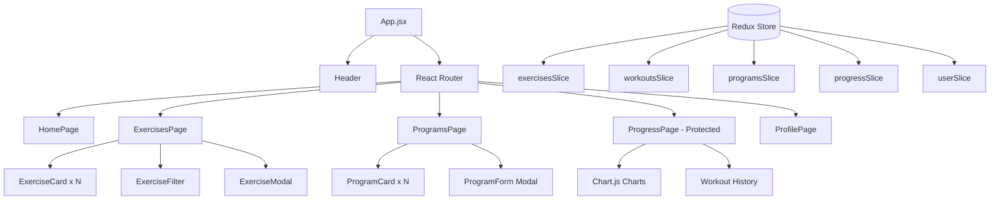

# Strenvy - Technical Report

## Обзор проекта

**Strenvy** — это Single Page Application (SPA) для планирования фитнес-тренировок, построенное на React + Redux Toolkit. Приложение позволяет пользователям просматривать библиотеку упражнений, создавать индивидуальные тренировочные программы и отслеживать прогресс.

## Архитектура

### Container/Presenter Pattern

```
src/
├── components/          # Presentational компоненты (только UI)
│   ├── common/         # Переиспользуемые: Button, Modal, Loading
│   ├── exercises/      # ExerciseCard, ExerciseFilter, ExerciseModal
│   ├── programs/       # ProgramForm
│   └── layout/         # Header
├── pages/              # Page-level компоненты (контейнеры с логикой)
│   ├── HomePage.jsx
│   ├── ExercisesPage.jsx
│   ├── ProgramsPage.jsx
│   ├── ProgressPage.jsx
│   └── ProfilePage.jsx
└── store/              # Redux state management
    ├── index.js
    └── slices/
        ├── exercisesSlice.js
        ├── workoutsSlice.js
        ├── programsSlice.js
        ├── progressSlice.js
        └── userSlice.js
```

### Диаграмма компонентов



---

## Технический стек

| Технология | Версия | Назначение |
|-----------|--------|------------|
| React | 19.2.0 | UI библиотека |
| Redux Toolkit | 2.11.2 | State management |
| React Router | 7.13.0 | Маршрутизация |
| Chart.js | 4.5.1 | Визуализация графиков |
| Lucide React | 0.563.0 | Иконки |
| Vite | 7.2.4 | Сборка проекта |
| Vitest | 4.0.18 | Unit-тестирование |

---

## Реализованные требования

### 1. State Management (Redux Toolkit + Async Thunks)

```javascript
// Async thunk для загрузки упражнений
export const fetchExercises = createAsyncThunk(
  'exercises/fetchExercises',
  async (_, { rejectWithValue }) => {
    try {
      const response = await import('../../data/exercises.json');
      return response.default.map(exercise => ({
        ...exercise,
        localGif: `/gifs/${getImageId(exercise.gifUrl)}.gif`,
      }));
    } catch (error) {
      return rejectWithValue(error.message);
    }
  }
);
```

**Слайсы:**
- `exercisesSlice` — загрузка ~1300 упражнений, фильтрация
- `workoutsSlice` — CRUD для тренировок (localStorage)
- `programsSlice` — программы (админские + пользовательские)
- `progressSlice` — история тренировок и статистика
- `userSlice` — аутентификация и настройки

### 2. Routing (Nested, Protected, Lazy Loading)

```javascript
// Lazy loading страниц
const HomePage = lazy(() => import('./pages/HomePage'));
const ExercisesPage = lazy(() => import('./pages/ExercisesPage'));
const ProgramsPage = lazy(() => import('./pages/ProgramsPage'));
const ProgressPage = lazy(() => import('./pages/ProgressPage'));
const ProfilePage = lazy(() => import('./pages/ProfilePage'));

// Protected route
<Route 
  path="/progress" 
  element={
    <PrivateRoute>
      <ProgressPage />
    </PrivateRoute>
  } 
/>
```

### 3. Performance Optimization

```javascript
// React.memo для presentational компонентов
const ExerciseCard = memo(function ExerciseCard({ exercise, onSelect }) {
  // ...
});

// useMemo для дорогих вычислений
const paginatedExercises = useMemo(() => {
  return filtered.slice(0, page * itemsPerPage);
}, [filtered, page]);

// useCallback для обработчиков событий
const handleFilterChange = useCallback((key, value) => {
  dispatch(setFilter({ key, value }));
}, [dispatch]);
```

### 4. Complex Form with Async Validation

```javascript
// Асинхронная валидация имени программы
const validateName = useCallback(async (name) => {
  setIsValidating(true);
  await new Promise(resolve => setTimeout(resolve, 500));
  setIsValidating(false);
  return name.length >= 3;
}, []);

// Валидация формы
const validateStep1 = useCallback(async () => {
  const newErrors = {};
  if (!formData.name.trim()) {
    newErrors.name = 'Program name is required';
  } else {
    const isValid = await validateName(formData.name);
    if (!isValid) {
      newErrors.name = 'Program name must be at least 3 characters';
    }
  }
  // ...
}, [formData, validateName]);
```

### 5. Unit Tests (27 тестов)

```bash
✓ src/tests/exercisesSlice.test.js (7 tests)
✓ src/tests/workoutsSlice.test.js (7 tests)
✓ src/tests/programsSlice.test.js (7 tests)
✓ src/tests/progressSlice.test.js (6 tests)

Test Files  4 passed (4)
     Tests  27 passed (27)
```

**Покрытие тестами:**
- Reducers и actions всех слайсов
- Async thunk states (pending, fulfilled, rejected)
- CRUD операции
- Фильтрация и поиск

---

## Функциональность

### Библиотека упражнений
- 1300+ упражнений с GIF-анимациями
- Фильтрация по группе мышц, оборудованию, целевой мышце
- Поиск по названию
- Пагинация с "Load More"

### Тренировочные программы
- **Готовые программы** (от администраторов):
  - Beginner Full Body
  - Push Pull Legs
  - Upper Lower Split
- **Пользовательские программы**:
  - Выбор длительности (1-52 недели)
  - Выбор дней тренировок
  - Добавление упражнений на каждый день

### Трекер прогресса
- Статистика: streak, общее количество тренировок, объём
- График активности по неделям (Chart.js)
- Распределение по группам мышц (Doughnut chart)
- История тренировок

### Профиль пользователя
- Регистрация/авторизация (localStorage)
- Цели тренировок
- Настройки (единицы измерения, тема)

---

## Запуск проекта

```bash
# Установка зависимостей
cd strenvy
npm install

# Запуск dev-сервера
npm run dev

# Production билд
npm run build

# Запуск тестов
npm test

# Тесты с покрытием
npm run test:coverage
```

---

## Структура данных

### Exercise
```typescript
interface Exercise {
  id: string;
  name: string;
  bodyPart: string;      // waist, chest, back, etc.
  equipment: string;     // body weight, barbell, dumbbell
  target: string;        // abs, pectorals, quads
  secondaryMuscles: string[];
  instructions: string[];
  gifUrl: string;
  localGif: string;      // /gifs/{id}.gif
  localPng: string;      // /gifs/{id}.png
}
```

### Program
```typescript
interface Program {
  id: string;
  name: string;
  description: string;
  duration: number;      // недели
  daysPerWeek: string[]; // ['monday', 'wednesday', 'friday']
  difficulty: 'beginner' | 'intermediate' | 'advanced';
  isAdmin: boolean;
  schedule: {
    [day: string]: {
      name: string;
      exercises: Exercise[];
    }
  }
}
```

---

## Заключение

Проект **Strenvy** успешно реализует все технические требования:

- ✅ React SPA с Redux Toolkit
- ✅ Async thunks для загрузки данных
- ✅ React Router с lazy loading и protected routes
- ✅ Оптимизация производительности (memo, useMemo, useCallback)
- ✅ Сложная форма с асинхронной валидацией
- ✅ 27 unit-тестов
- ✅ Архитектура Container/Presenter
