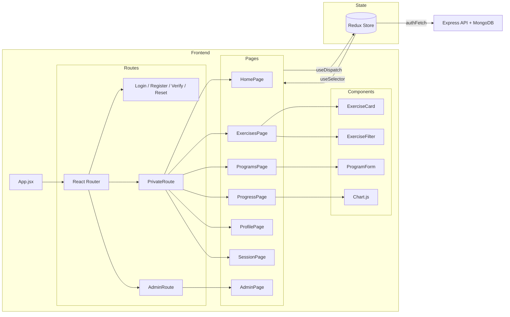
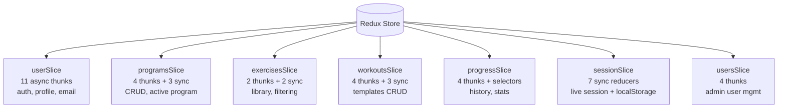
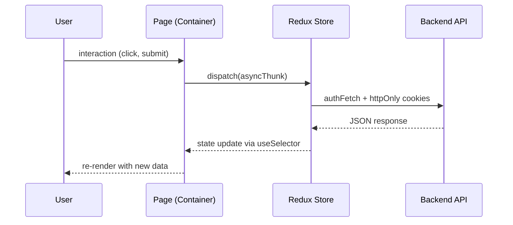

# Strenvy - Technical Report

## 1. Project Overview

**Strenvy** is a full-scale Single Page Application (SPA) for fitness workout planning and tracking, built with React 19 and Redux Toolkit. The application features a real Express.js + MongoDB backend with JWT authentication, email verification, and a RESTful API. Users can browse 1300+ exercises, create custom training programs with a calendar-based scheduler, run live workout sessions with set/rep tracking, and monitor progress through charts and statistics.

---

## 2. Architecture Description

### Container/Presenter Pattern

The application follows a strict separation between container components (pages with business logic and Redux access) and presentational components (pure UI driven by props).

```
strenvy/src/
├── pages/                    # Containers — business logic, Redux, API
│   ├── HomePage.jsx          # Dashboard with active program, today's workout
│   ├── ExercisesPage.jsx     # Exercise library with filtering & pagination
│   ├── ProgramsPage.jsx      # Program management (create, edit, activate)
│   ├── ProgressPage.jsx      # Workout history, stats, Chart.js graphs
│   ├── ProfilePage.jsx       # User profile, preferences, goals
│   ├── AdminPage.jsx         # Admin panel (users, exercises, programs CRUD)
│   ├── WorkoutSessionPage.jsx# Live session with set/rep tracking
│   ├── LoginPage.jsx         # Authentication
│   ├── RegisterPage.jsx      # Registration with validation
│   ├── VerifyEmailPage.jsx   # Email verification flow
│   ├── ForgotPasswordPage.jsx# Password recovery
│   └── ResetPasswordPage.jsx # Password reset with token
│
├── components/               # Presenters — pure UI, no Redux
│   ├── common/
│   │   ├── PrivateRoute.jsx  # Auth guard (memo)
│   │   ├── AdminRoute.jsx    # Admin guard
│   │   └── Loading.jsx       # Loading spinner (memo)
│   ├── exercises/
│   │   ├── ExerciseCard.jsx  # Exercise display card (memo + useCallback)
│   │   ├── ExerciseFilter.jsx# Filter controls (memo + useCallback)
│   │   └── ExerciseModal.jsx # Exercise detail modal (memo)
│   ├── programs/
│   │   └── ProgramForm.jsx   # Complex multi-step form (memo + useMemo + useCallback)
│   └── layout/
│       └── Header.jsx        # Navigation header (memo)
│
├── store/                    # Redux Toolkit state management
│   ├── index.js              # Store configuration (7 slices)
│   └── slices/
│       ├── userSlice.js      # Auth: register, login, checkAuth, logout, verify, reset (11 thunks)
│       ├── programsSlice.js  # Programs CRUD + active program (4 thunks + 3 sync)
│       ├── exercisesSlice.js # Exercise library + filtering (2 thunks + 2 sync)
│       ├── workoutsSlice.js  # Workout templates CRUD (4 thunks + 3 sync)
│       ├── progressSlice.js  # History, stats, selectors (4 thunks + 2 selectors)
│       ├── sessionSlice.js   # Live session state (7 sync reducers + localStorage)
│       └── usersSlice.js     # Admin user management (4 thunks + 1 sync)
│
├── utils/
│   └── api.js                # API config + authFetch with automatic token refresh
│
├── tests/                    # Unit & component tests (133 tests)
│   ├── exercisesSlice.test.js
│   ├── programsSlice.test.js
│   ├── progressSlice.test.js
│   ├── workoutsSlice.test.js
│   ├── userSlice.test.js
│   ├── sessionSlice.test.js
│   ├── usersSlice.test.js
│   ├── components/
│   │   ├── Loading.test.jsx
│   │   ├── PrivateRoute.test.jsx
│   │   ├── AdminRoute.test.jsx
│   │   ├── ExerciseCard.test.jsx
│   │   └── ExerciseFilter.test.jsx
│   └── setup.js
│
├── App.jsx                   # Root: Provider + BrowserRouter + lazy routes
├── main.jsx                  # Entry point
└── index.css                 # Global styles

backend/                      # Express.js REST API
├── models/                   # Mongoose schemas (User, Program, Exercise, Workout, History)
├── routes/                   # API endpoints (auth, programs, exercises, workouts, history, user, users)
├── middleware/                # JWT auth middleware
├── utils/                    # Email service (Gmail SMTP)
├── server.js                 # Express server setup
└── db.js                     # MongoDB connection
```

### Application Architecture


```mermaid
graph LR
    subgraph Frontend
        App[App.jsx] --> Router[React Router]

        subgraph Routes
            Router --> Public[Login / Register / Verify / Reset]
            Router --> Private[PrivateRoute]
            Router --> Admin[AdminRoute]
        end

        subgraph Pages
            Private --> P1[HomePage]
            Private --> P2[ExercisesPage]
            Private --> P3[ProgramsPage]
            Private --> P4[ProgressPage]
            Private --> P5[ProfilePage]
            Private --> P6[SessionPage]
            Admin --> P7[AdminPage]
        end

        subgraph Components
            P2 --> C1[ExerciseCard]
            P2 --> C2[ExerciseFilter]
            P3 --> C3[ProgramForm]
            P4 --> C4[Chart.js]
        end
    end

    subgraph State
        Store[(Redux Store)]
    end

    Pages -->|useDispatch| Store
    Store -->|useSelector| Pages

    Store -->|authFetch| API[Express API + MongoDB]
```

### Redux Store Structure


```mermaid
graph TD
    Store[(Redux Store)] --> U[userSlice<br/>11 async thunks<br/>auth, profile, email]
    Store --> P[programsSlice<br/>4 thunks + 3 sync<br/>CRUD, active program]
    Store --> E[exercisesSlice<br/>2 thunks + 2 sync<br/>library, filtering]
    Store --> W[workoutsSlice<br/>4 thunks + 3 sync<br/>templates CRUD]
    Store --> PR[progressSlice<br/>4 thunks + selectors<br/>history, stats]
    Store --> S[sessionSlice<br/>7 sync reducers<br/>live session + localStorage]
    Store --> US[usersSlice<br/>4 thunks<br/>admin user mgmt]
```

### Data Flow


```mermaid
sequenceDiagram
    participant User
    participant Page as Page (Container)
    participant Store as Redux Store
    participant API as Backend API

    User->>Page: interaction (click, submit)
    Page->>Store: dispatch(asyncThunk)
    Store->>API: authFetch + httpOnly cookies
    API-->>Store: JSON response
    Store-->>Page: state update via useSelector
    Page-->>User: re-render with new data
```

---

## 3. Technical Justification

### Why React?

| Factor | React | Angular |
|--------|-------|---------|
| Learning curve | Gradual, component-focused | Steep, full framework |
| Bundle size | ~45KB (react + react-dom) | ~150KB+ (core framework) |
| Ecosystem flexibility | Choose your own tools | Opinionated, built-in |
| Performance tuning | memo, useMemo, useCallback | OnPush, trackBy |
| State management | Redux Toolkit (mature, typed) | RxJS (powerful but complex) |

React was chosen for its component-centric architecture, rich ecosystem, and explicit performance control. Combined with Redux Toolkit, it provides predictable state management with minimal boilerplate through `createSlice` and `createAsyncThunk`.

### Why Redux Toolkit?

- **`createAsyncThunk`** — eliminates boilerplate for async API calls with built-in pending/fulfilled/rejected lifecycle
- **`createSlice`** — combines reducer + actions in one declaration with Immer for immutable updates
- **Centralized state** — single source of truth for 7 domain slices covering auth, programs, exercises, workouts, progress, sessions, and admin
- **DevTools integration** — full state inspection and time-travel debugging

### Why Real Backend over Mock API?

The project uses a real Express.js + MongoDB backend instead of JSON-Server to demonstrate:
- JWT authentication with httpOnly cookies (access + refresh tokens)
- Email verification and password reset via Gmail SMTP
- Role-based authorization (user/admin)
- Proper RESTful API design with Mongoose schemas

---

## 4. Technical Requirements Implementation

### 4.1 State Management (Redux Toolkit + Async Thunks)

**7 Redux slices** with **29 async thunks** and **16 sync reducers**:

```javascript
// Example: userSlice.js — login thunk with JWT cookies
export const loginUser = createAsyncThunk(
    'user/login',
    async ({ email, password }, { rejectWithValue }) => {
        try {
            const response = await fetch(`${api.auth}/login`, {
                method: 'POST',
                credentials: 'include', // httpOnly cookies
                headers: { 'Content-Type': 'application/json' },
                body: JSON.stringify({ email, password }),
            });
            const data = await response.json();
            if (!response.ok) throw new Error(data.error || 'Login failed');
            return data.user;
        } catch (error) {
            return rejectWithValue(error.message);
        }
    }
);
```

```javascript
// Example: programsSlice.js — extraReducers with state separation
.addCase(fetchPrograms.fulfilled, (state, action) => {
    state.loading = false;
    if (Array.isArray(action.payload)) {
        state.adminPrograms = action.payload.filter(p => p.isAdmin);
        state.userPrograms = action.payload.filter(p => !p.isAdmin);
    }
})
```

### 4.2 Routing (Protected Routes + Lazy Loading)

**12 routes** with two levels of protection and lazy loading on all pages:

```javascript
// App.jsx — Lazy loading with Suspense
const HomePage = lazy(() => import('./pages/HomePage'));
const ExercisesPage = lazy(() => import('./pages/ExercisesPage'));
const ProgramsPage = lazy(() => import('./pages/ProgramsPage'));
// ... 9 more lazy-loaded pages

<Suspense fallback={<Loading text="Loading page..." />}>
  <Routes>
    {/* Public routes */}
    <Route path="/login" element={<LoginPage />} />
    <Route path="/register" element={<RegisterPage />} />

    {/* Protected routes — require authentication */}
    <Route path="/" element={<PrivateRoute><HomePage /></PrivateRoute>} />
    <Route path="/exercises" element={<PrivateRoute><ExercisesPage /></PrivateRoute>} />

    {/* Admin routes — require admin role */}
    <Route path="/admin" element={<AdminRoute><AdminPage /></AdminRoute>} />
  </Routes>
</Suspense>
```

```javascript
// PrivateRoute.jsx — Authentication guard
const PrivateRoute = memo(function PrivateRoute({ children }) {
    const { isAuthenticated, authChecked } = useSelector(state => state.user);
    if (!authChecked) return <Loading text="Checking authentication..." />;
    if (!isAuthenticated) return <Navigate to="/login" state={{ from: location }} replace />;
    return children;
});
```

```javascript
// AdminRoute.jsx — Role-based guard (extends PrivateRoute logic)
if (!isAuthenticated) return <Navigate to="/login" />;
if (!isAdmin) return <Navigate to="/" />;
return children;
```

### 4.3 Performance Optimization

**Strategic memoization** applied to all presentational components and expensive computations:

**React.memo** — 8 components wrapped to prevent unnecessary re-renders:
```javascript
// ExerciseCard.jsx — memo prevents re-render when parent updates unrelated state
const ExerciseCard = memo(function ExerciseCard({ exercise, onSelect, onViewDetails, isSelected, selectable }) {
    // useCallback for stable handler references
    const handleImageError = useCallback(() => setImageError(true), []);
    const handleClick = useCallback(() => {
        if (selectable && onSelect) onSelect(exercise);
        else if (onViewDetails) onViewDetails(exercise);
    }, [selectable, onSelect, onViewDetails, exercise]);
    // ...
});
```

**useMemo** — expensive computations cached:
```javascript
// HomePage.jsx — find today's workout from program schedule
const todayWorkout = useMemo(() => {
    if (!activeProgram) return null;
    // Complex lookup through schedule/scheduleDates maps
}, [activeProgram]);

// ProgramForm.jsx — 42-day calendar grid calculation
const calendarDays = useMemo(() => {
    const days = [];
    // Generate 6-week calendar grid with date objects
    return days;
}, [currentMonth]);

// AdminPage.jsx — filter users/exercises by search term
const filteredUsers = useMemo(() =>
    users.filter(u => u.name?.toLowerCase().includes(searchTerm.toLowerCase())),
[users, searchTerm]);
```

**useCallback** — 20+ event handlers stabilized:
```javascript
// ExerciseFilter.jsx — stable callbacks for child components
const handleSearchChange = useCallback((e) => {
    onFilterChange('search', e.target.value);
}, [onFilterChange]);

// App.jsx — menu toggle
const handleMenuToggle = useCallback(() => {
    setIsMenuOpen(prev => !prev);
}, []);
```

**Lazy loading** — all 12 pages loaded on demand via `React.lazy()`, reducing initial bundle size.

### 4.4 Complex Form with Async Validation

**ProgramForm.jsx** — multi-step form with calendar UI, exercise selection, and async validation:

```javascript
// Step 1: Program info + calendar date selection
// Step 2: Exercise assignment per selected date
const [step, setStep] = useState(1);

// Async validation with loading state
const validateForm = useCallback(async () => {
    const newErrors = {};
    setIsValidating(true);

    // Simulate async validation (e.g., check program name uniqueness)
    await new Promise(resolve => setTimeout(resolve, 300));

    if (!formData.name.trim()) {
        newErrors.name = 'Program name is required';
    }
    if (selectedDates.length === 0) {
        newErrors.dates = 'Select at least one training day';
    }
    // Validate exercises assigned to each date...

    setIsValidating(false);
    setErrors(newErrors);
    return Object.keys(newErrors).length === 0;
}, [formData, selectedDates]);
```

Form features:
- **Multi-step navigation** with progress indicator
- **Interactive calendar** — 6-week grid, date selection with past-date prevention
- **Dynamic exercise picker** — search, filter by bodyPart/equipment/target
- **Per-date exercise configuration** — sets, reps, rest per exercise per day
- **Async validation** — validates on step transition and before submission
- **Edit mode** — pre-populates form when editing existing programs

### 4.5 Architecture: Container/Presenter Separation

| Layer | Role | Redux Access | Examples |
|-------|------|-------------|----------|
| **Pages (Containers)** | Business logic, data fetching, state orchestration | `useSelector`, `useDispatch` | HomePage, ExercisesPage, AdminPage |
| **Components (Presenters)** | Pure UI rendering, props-driven | None | ExerciseCard, ExerciseFilter, ProgramForm, Header |
| **Store (Slices)** | State management, async operations | Internal | userSlice, programsSlice, sessionSlice |
| **Utils** | API configuration, shared helpers | None | api.js (authFetch with token refresh) |

---

## 5. Test Results

### Test Suite: 133 tests across 12 files — all passed

```
 ✓ src/tests/sessionSlice.test.js        (14 tests)  29ms
 ✓ src/tests/workoutsSlice.test.js       (14 tests)  13ms
 ✓ src/tests/progressSlice.test.js       (10 tests)  15ms
 ✓ src/tests/userSlice.test.js           (27 tests)  16ms
 ✓ src/tests/exercisesSlice.test.js       (7 tests)  25ms
 ✓ src/tests/usersSlice.test.js          (14 tests)  24ms
 ✓ src/tests/programsSlice.test.js       (17 tests)  26ms
 ✓ src/tests/components/PrivateRoute.test.jsx  (3 tests)  69ms
 ✓ src/tests/components/AdminRoute.test.jsx    (4 tests)  70ms
 ✓ src/tests/components/ExerciseCard.test.jsx (10 tests)  84ms
 ✓ src/tests/components/ExerciseFilter.test.jsx (9 tests) 99ms
 ✓ src/tests/components/Loading.test.jsx       (4 tests)  36ms

 Test Files  12 passed (12)
      Tests  133 passed (133)
   Duration  3.46s
```

### Coverage by Area

| Test File | Tests | What's Covered |
|-----------|-------|----------------|
| **userSlice.test.js** | 27 | Register, login, checkAuth, logout, verifyEmail, forgotPassword, resetPassword, updateProfile, updatePreferences, setGoals — all pending/fulfilled/rejected states |
| **programsSlice.test.js** | 17 | fetchPrograms, createProgram, editProgram, removeProgram thunks + setActiveProgram, clearActiveProgram, setEditingProgram sync actions + localStorage persistence |
| **sessionSlice.test.js** | 14 | startSession (exercise mapping, default values), updateSet, toggleSetComplete, addSet (copy from last), removeSet (renumber), setCurrentExercise, endSession + localStorage |
| **workoutsSlice.test.js** | 14 | fetchWorkouts, createWorkout, editWorkout, removeWorkout thunks + sync reducers + edge cases (not found, last item) |
| **usersSlice.test.js** | 14 | Admin CRUD: fetchUsers, createUser, updateUser, deleteUser + clearError + error handling |
| **progressSlice.test.js** | 10 | fetchHistory, logWorkout, updateWorkoutLog, deleteWorkoutLog + volume calculation + selectMuscleGroupDistribution selector |
| **exercisesSlice.test.js** | 7 | setFilter, clearFilters, fetchExercises states, search filter, multi-filter combination |
| **PrivateRoute.test.jsx** | 3 | Loading state, authenticated render, redirect to /login |
| **AdminRoute.test.jsx** | 4 | Loading state, admin render, redirect to /login, redirect non-admin to / |
| **ExerciseCard.test.jsx** | 10 | Render name/badges/equipment, View/Add/Selected buttons, click handlers, selected class, lazy image loading |
| **ExerciseFilter.test.jsx** | 9 | Search input, dropdown options, onFilterChange callbacks, Clear button visibility and click |
| **Loading.test.jsx** | 4 | Default text, custom text, spinner rings, container class |

---

## 6. Technology Stack

| Technology | Version | Purpose |
|-----------|---------|---------|
| React | 19.2.0 | UI library |
| Redux Toolkit | 2.11.2 | Centralized state management |
| React Router | 7.13.0 | Client-side routing |
| Chart.js | 4.5.1 | Progress visualization (Line, Doughnut) |
| react-chartjs-2 | 5.3.1 | React wrapper for Chart.js |
| Lucide React | 0.563.0 | Icon library |
| Vite | 7.2.4 | Build tool & dev server |
| Vitest | 4.0.18 | Unit testing framework |
| Testing Library | 16.3.2 | Component testing utilities |
| Express.js | 4.x | Backend REST API |
| MongoDB + Mongoose | 7.x | Database & ODM |
| JWT (jsonwebtoken) | — | Authentication tokens |
| bcrypt | — | Password hashing |
| Nodemailer | — | Email verification (Gmail SMTP) |

---

## 7. Application Features

### Exercise Library
- 1300+ exercises with GIF animations and PNG thumbnails
- Multi-criteria filtering: body part, equipment, target muscle
- Text search by exercise name
- Infinite scroll pagination with "Load More"
- Detail modal with instructions and secondary muscles

### Training Programs
- **Admin programs** — pre-built programs (Beginner Full Body, Push Pull Legs, Upper Lower Split) with day-of-week schedule
- **User programs** — custom calendar-based scheduling with date picker, exercise assignment per day, sets/reps/rest configuration
- Active program selection with localStorage persistence

### Live Workout Session
- Start session from active program's scheduled workout
- Per-set weight and reps input
- Set completion toggle
- Add/remove sets dynamically
- Session state persisted in localStorage (survives page refresh)
- Session completion logs to workout history

### Progress Tracking
- Statistics: workout streak, total workouts, total exercises, total volume
- Weekly activity chart (Chart.js Line)
- Muscle group distribution (Chart.js Doughnut)
- Full workout history with dates

### User Management
- Registration with email verification (Gmail SMTP, port 465, SSL)
- Login with JWT httpOnly cookies (access + refresh tokens)
- Automatic token refresh on 401 responses (authFetch utility)
- Password reset via email
- Profile editing, preferences (units, theme), fitness goals

### Admin Panel
- User management: view, create, edit roles, delete
- Exercise management: edit exercise details
- Program management: create/edit admin programs

---

## 8. Deployment Plan

### Build Steps

```bash
# Frontend
cd strenvy
npm install
npm run build          # Creates dist/ with optimized production bundle

# Backend
cd backend
npm install
node server.js         # Starts Express on port 3000
```

### Environment Variables (backend/.env)

```
MONGODB_URI=mongodb://localhost:27017/strenvy
JWT_SECRET=<secret>
JWT_REFRESH_SECRET=<secret>
GMAIL_USER=<email>
GMAIL_PASS=<app-password>
CLIENT_URL=http://localhost:5173
```

### CI/CD Pipeline (GitHub Actions example)

```yaml
name: CI/CD
on:
  push:
    branches: [main]
  pull_request:
    branches: [main]

jobs:
  test:
    runs-on: ubuntu-latest
    steps:
      - uses: actions/checkout@v4
      - uses: actions/setup-node@v4
        with:
          node-version: 20
      - run: cd strenvy && npm ci
      - run: cd strenvy && npx vitest run
      - run: cd strenvy && npm run lint

  build:
    needs: test
    runs-on: ubuntu-latest
    steps:
      - uses: actions/checkout@v4
      - uses: actions/setup-node@v4
        with:
          node-version: 20
      - run: cd strenvy && npm ci
      - run: cd strenvy && npm run build
      - uses: actions/upload-artifact@v4
        with:
          name: dist
          path: strenvy/dist/
```

### Production Deployment Options

| Option | Frontend | Backend |
|--------|----------|---------|
| **Vercel + Railway** | Vercel (static hosting for dist/) | Railway (Node.js + MongoDB Atlas) |
| **VPS (DigitalOcean)** | Nginx serving dist/ | PM2 process manager for Express |
| **Docker** | Multi-stage build with Nginx | Node.js container + MongoDB container |

---

## 9. Conclusion

**Strenvy** implements all mandatory technical requirements:

- **State Management** — Redux Toolkit with 29 async thunks across 7 slices, handling auth, CRUD, sessions, and admin operations
- **Routing** — React Router 7 with PrivateRoute and AdminRoute guards, React.lazy + Suspense for lazy loading all 12 pages
- **Performance** — React.memo on 8 components, useMemo for expensive computations, useCallback for 20+ handlers, lazy loading for code splitting
- **Complex Form** — Multi-step ProgramForm with calendar UI, dynamic exercise selection, async validation, and edit mode
- **Testing** — 133 unit tests across 12 files covering all 7 Redux slices (reducers + thunk states) and 5 React components
- **Architecture** — Clear Container/Presenter separation with pages as containers and components as pure presenters
